# Community Service Volunteer Tracking System (CSVTS)

A web app that helps NGOs manage volunteers, assign tasks, track and approve service hours, and generate reports. Built with Java 17, Spring Boot 3, Thymeleaf, and PostgreSQL.

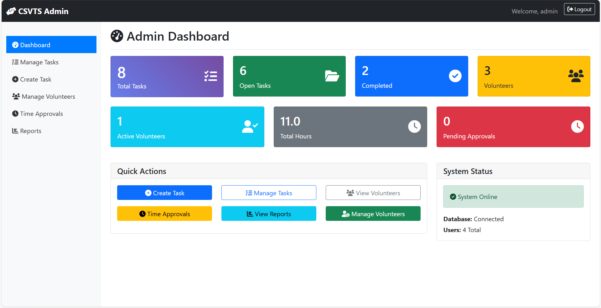

---

## 🚀 Features

**For administrators**
- Create, edit, and delete volunteer tasks with due dates and status (Open, In Progress, Completed)
- Assign volunteers to tasks and see who is working on what
- Review hours that volunteers submit and approve or reject each entry
- Search and filter volunteers by name, email, or skill
- View reports on volunteer hours and task completion rates, and export them as CSV

**For volunteers**
- Register with skills and availability
- See assigned tasks, start them, and mark them complete
- Log hours against tasks and track their approval status
- Update their own profile

**Security**
- Role-based access with Spring Security (separate Admin and Volunteer areas)
- Passwords stored as BCrypt hashes

---

## 🛠 Tech Stack

| Layer    | Technologies                                        |
|----------|-----------------------------------------------------|
| Backend  | Java 17, Spring Boot 3.5, Spring Data JPA, Spring Security |
| Frontend | Thymeleaf, HTML, CSS, JavaScript                    |
| Database | PostgreSQL                                          |
| Build    | Maven (wrapper included)                            |

---

## ⚙️ Getting Started

### Prerequisites
- Java 17 or later
- PostgreSQL 14 or later

You don't need to install Maven. The project includes the Maven wrapper (`mvnw`).

### 1. Clone the repository
```bash
git clone https://github.com/wantedProgrammer/Community-Service-Volunteer-Tracking-System.git
cd Community-Service-Volunteer-Tracking-System/csvts
```

### 2. Create the database
```sql
CREATE DATABASE csvts_db;
```

### 3. Configure the database connection
The connection settings are in `src/main/resources/application.properties`. The URL and username default to a local PostgreSQL install:

```properties
spring.datasource.url=jdbc:postgresql://localhost:5432/csvts_db
spring.datasource.username=postgres
spring.datasource.password=${DB_PASSWORD}
```

Set your PostgreSQL password as an environment variable instead of writing it into the file:

```bash
# macOS / Linux
export DB_PASSWORD=your_password

# Windows (PowerShell)
$env:DB_PASSWORD="your_password"
```

The tables are created automatically on first run.

### 4. Run the app
```bash
# macOS / Linux
./mvnw spring-boot:run

# Windows
mvnw.cmd spring-boot:run
```

Then open http://localhost:8080.

### 5. Log in
A default administrator account is created on first startup:

| Username | Password   |
|----------|------------|
| `admin`  | `admin123` |

⚠️ Change this password before using the app with real data.

Volunteers create their own accounts from the **Register** page.

---

## 📸 Screenshots

### Admin

| Manage Tasks | Assign Volunteers |
|---|---|
| 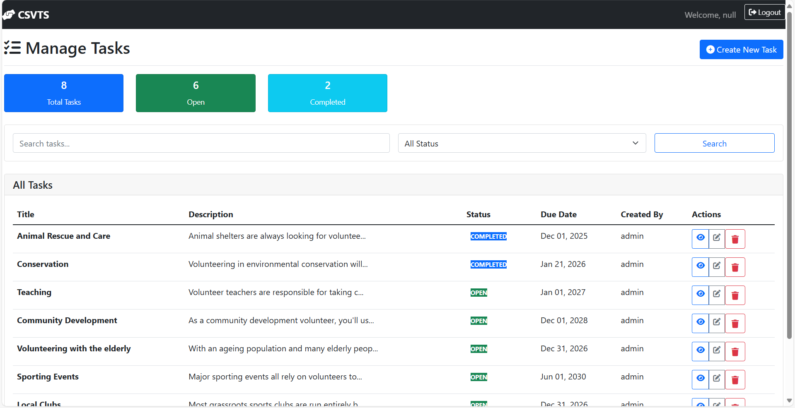 | 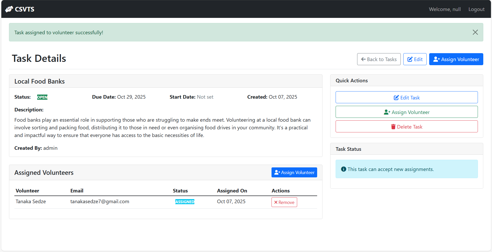 |

| Approve Hours | Manage Volunteers |
|---|---|
| 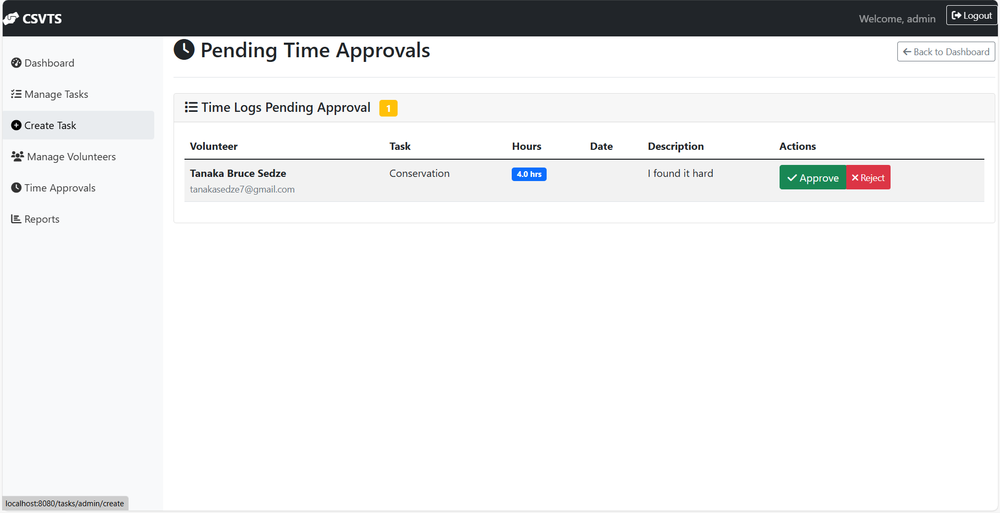 | 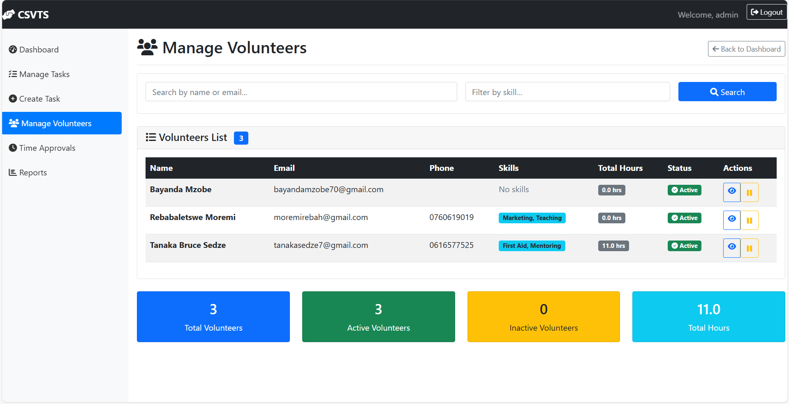 |

| Volunteer Hours Report | Task Completion Report |
|---|---|
| 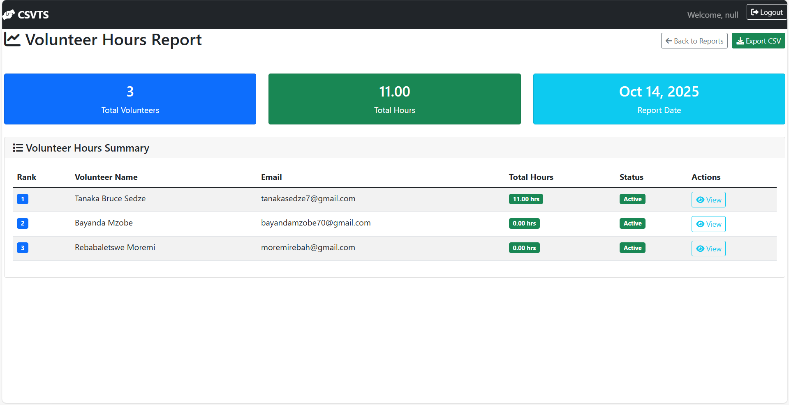 | 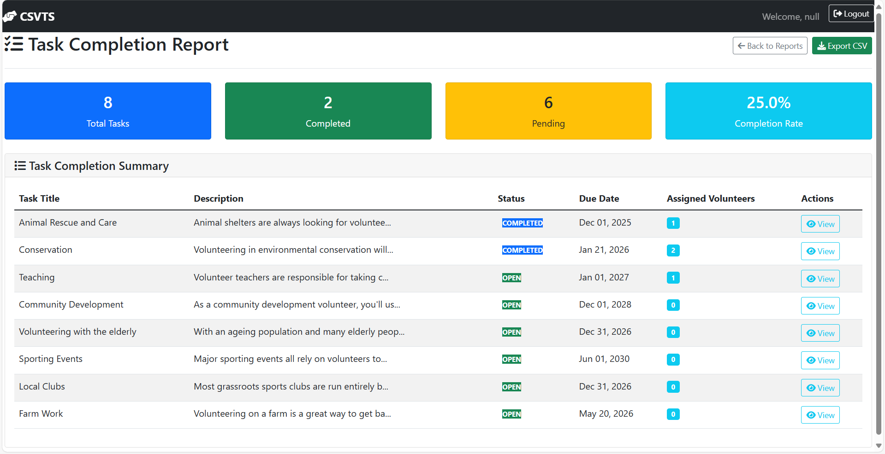 |

### Volunteer

| Dashboard | Time Logs |
|---|---|
| 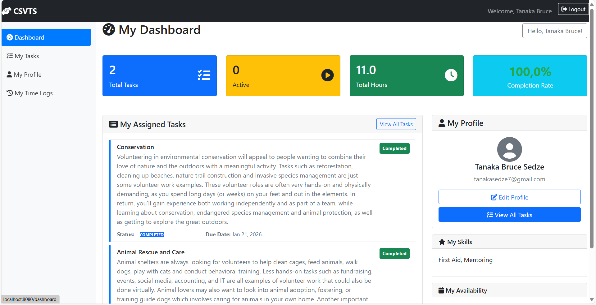 | 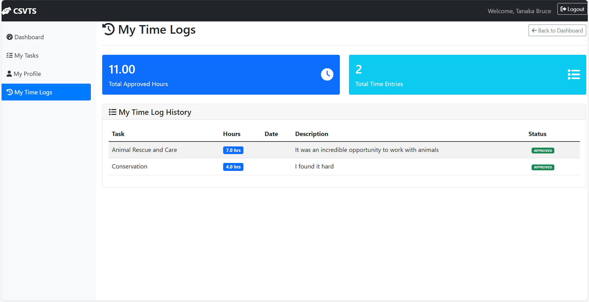 |

<details>
<summary><strong>More screenshots</strong></summary>

| Login | Register | Forgot Password |
|---|---|---|
| 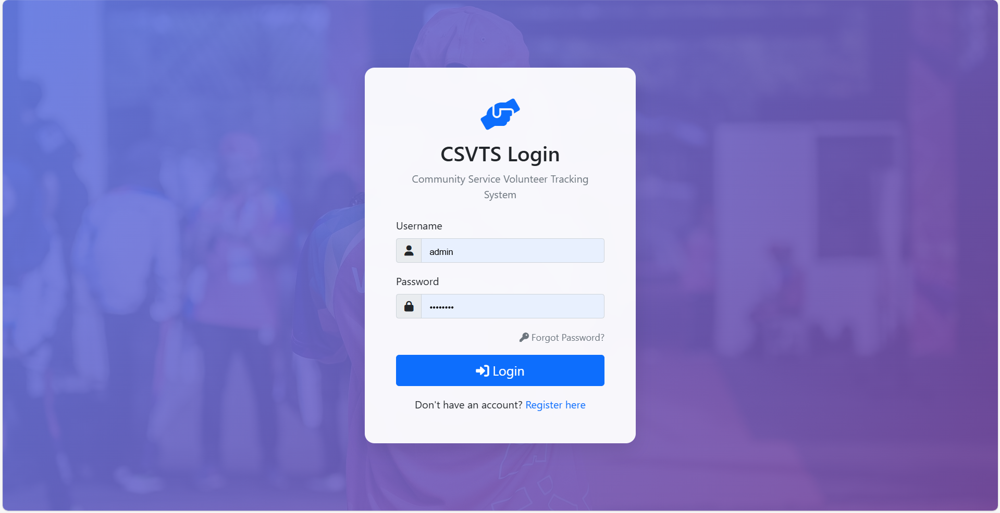 | 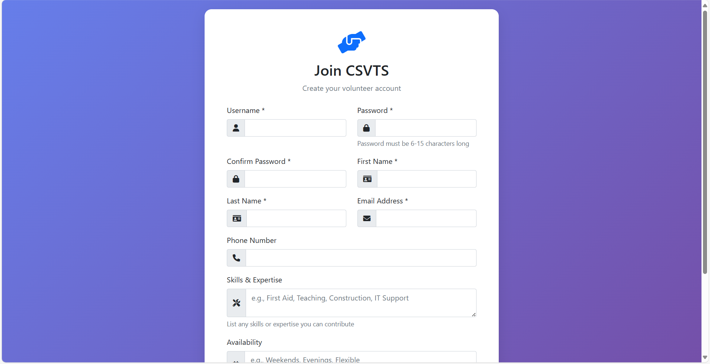 | 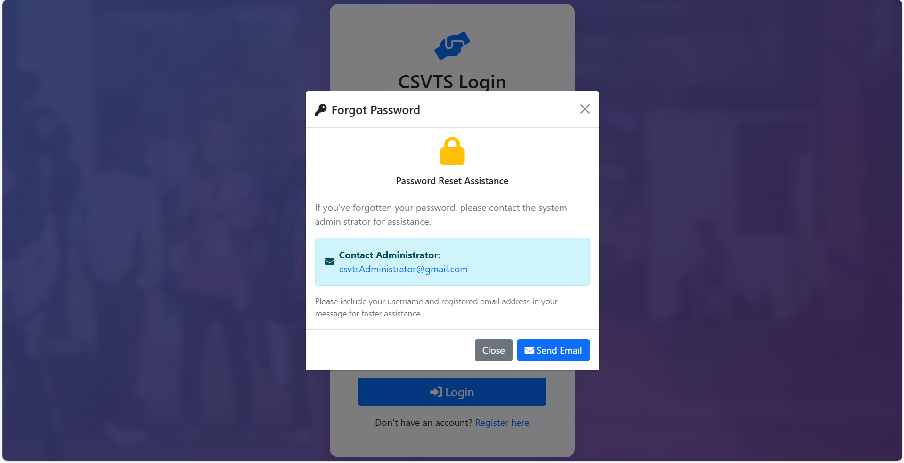 |

| Create Task | Reports Overview |
|---|---|
| 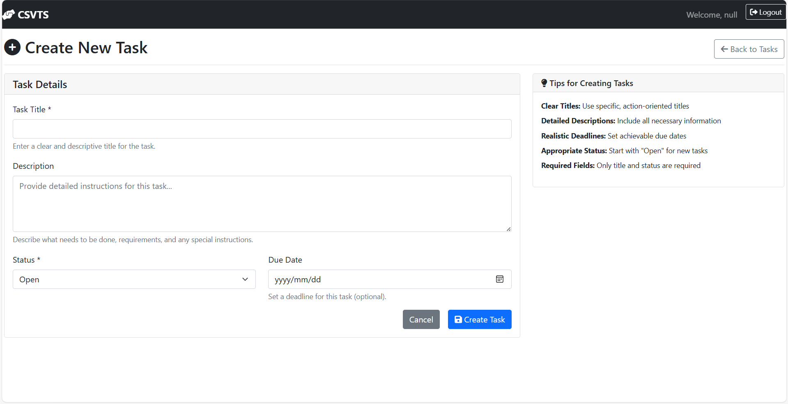 | 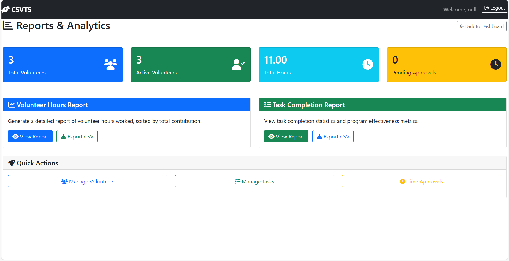 |

| My Tasks | My Profile |
|---|---|
| 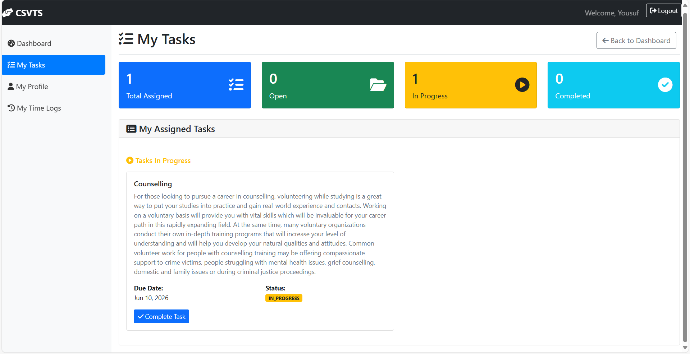 | 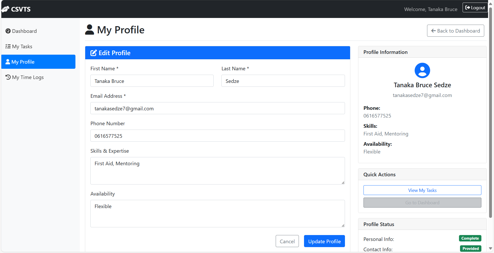 |

</details>

---

## 📁 Project Structure

```
csvts/
├── src/main/java/com/nwu/csvts/
│   ├── config/        # Startup configuration (default admin account)
│   ├── controller/    # Web controllers: auth, admin, tasks, assignments, volunteers, reports
│   ├── model/         # JPA entities: User, Volunteer, Admin, Task, Assignment, TimeLog
│   ├── repository/    # Spring Data repositories
│   ├── security/      # Spring Security configuration and user lookup
│   └── service/       # Business logic
├── src/main/resources/
│   ├── templates/     # Thymeleaf pages (admin, volunteer, auth, shared fragments)
│   ├── static/css/    # Stylesheets
│   └── application.properties
└── images/            # README screenshots
```

---

## 🧪 Running Tests

```bash
./mvnw test
```

---

## 🚧 Known Limitations & Roadmap

- **Password reset is manual.** "Forgot Password" tells users to contact the administrator. Automated email reset is a planned improvement.
- **No email notifications** yet for task assignments or hour approvals.
- **Test coverage is minimal.** Service and controller tests are planned.

---

## 📄 License

This project is licensed under the MIT License. See [LICENSE](LICENSE) for details.
